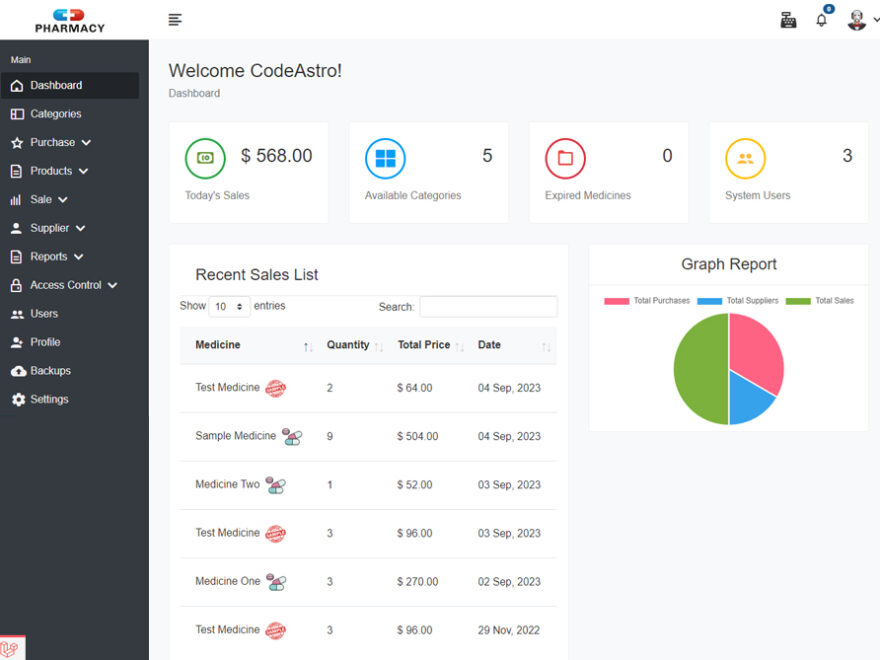

# Company-Visitor-Management-System
### Company-Visitor-Management-System in PHP

How to run the Company Visitors Management System (Code Camp BD - Visitor Management System) Project

1. Download the  zip file

2. Extract the file and copy company folder

3. Paste inside root directory(for xampp xampp/htdocs, for wamp wamp/www, for lamp var/www/html)

4. Open PHPMyAdmin (http://localhost/phpmyadmin)

5. Create a database with name: `ccbd_medipos`

6. Import `ccbd_medipos.sql` file(given inside the zip package in SQL file folder)

7. Install the composer dependencies: `composer install`

8. Also, install the npm packages: `npm install` and then `npm run dev`

7. Run the script -> `php artisan serve`

### Developer Info

- Author Name: MH RONY.
- GigHub Link: https://github.com/dev-mhrony
- Facebook Link:https://www.facebook.com/dev.mhrony
- Youtube Link: <a href = "https://www.youtube.com/@codecampbdofficial"> Code Camp BD</a>
- for any PHP, Laravel, Python, Dart, Flutter work contact me at developer.mhrony@gmail.com
- Visit My Website : https://developerrony.com

### Database Name
- `ccbd_medipos`

### Admin Login Info
 - User Email   : `admin@mail.com `
 - Password     : <a href = "#">Watch This Full Video</a>

### Preview

 - Deshbord
    
